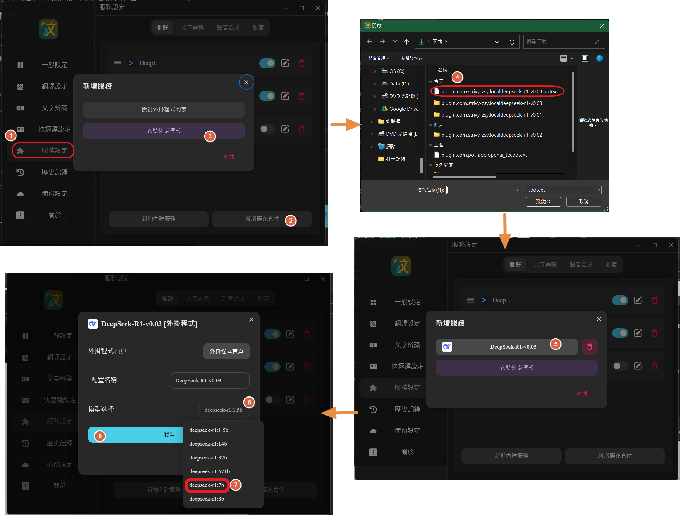
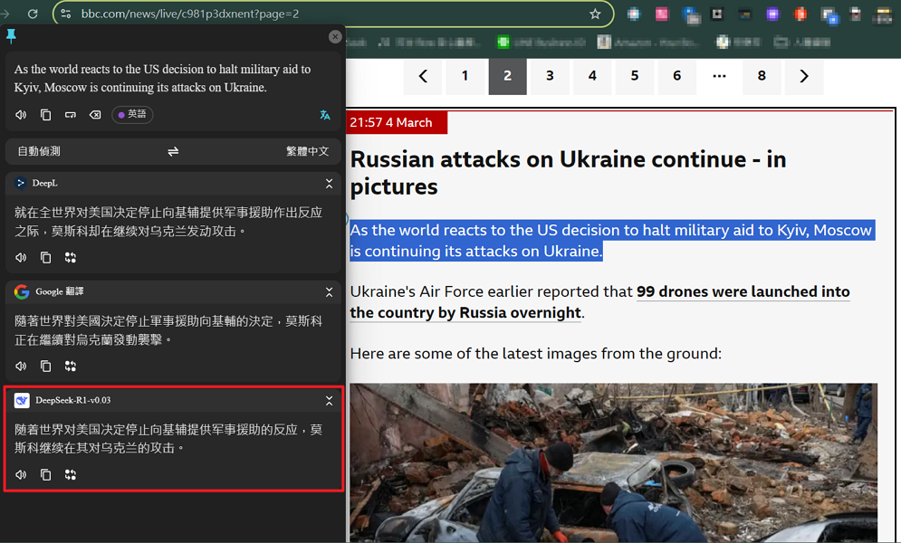

# Pot-App 本地deepseek-r1 翻译插件

此插件作為支持本地ollama deepseek-r1系列模型，並在POT输出窗口中不显示模型思考过程。

### 模型安装（根据自己的电脑配置安装相应版本，支持官方1.5b~8b）
Ollama模型网址：[deepseek-r1](https://ollama.com/library/deepseek-r1)
以7b为示例，确保您已安装Ollama后，在CMD终端输(命令提示字元)入以下命令
```
$ollama run deepseek-r1:7b
```
> 如果無法直接用Ollama指令直接下載7b模組，可改用[LM Studio軟體](https://lmstudio.ai/download)下載或到[Hugging Face網站](https://huggingface.co/unsloth/DeepSeek-R1-Distill-Qwen-7B-GGUF/tree/main)下載，我下載的Model版本是：deepseek-r1-distill-qwen-7b，量化大小：Q4_K_M，大小為4.68GB左右。 <br><br>詳細步驟如下：<br>
1.下載7b模組後，到存放模組的資料夾中，會看到檔名：DeepSeek-R1-Distill-Qwen-7B-Q4_K_M.gguf。<br><br>2.新增一個空白記事本內容添加一行如下：<br>FROM D:\models\Publisher\Repository\lmstudio-community\DeepSeek-R1-Distill-Qwen-7B-GGUF\DeepSeek-R1-Distill-Qwen-7B-Q4_K_M.gguf<br><br>記得將D:\models.....改成你存放模組的資料夾路徑，然後將該記事本另存新檔，檔名為：Modelfile，沒有副檔名，並將該檔存放在模組同階層資料夾。<br><br>3.查看11434 port有無被占用<br>因為運作本地端DeepSeek需使用11434接口，使用Windows打開CMD命令提示字元，執行：<br>
$netstat -ano | findstr :11434<br><br>如果結果顯示類似：<br>TCP    127.0.0.1:11434    0.0.0.0:0    LISTENING    12345<br>這表示 PID 為 12345 的程式已經佔用該端口，請結束佔用 12345 端口的程序，指令如下：<br>$taskkill /PID 12345 /F（請將 12345 替換為你查到的 PID）<br><br>4.到您剛才存放7b模組的路徑底下，如：<br>$cd D:\models\Publisher\Repository\lmstudio-community\DeepSeek-R1-Distill-Qwen-7B-GGUF<br><br>5.查看本機Ollama目前有哪些模組<br>$ollama list<br><br>6.(非必須)如果你需要刪除不要的模組，指令為：<br>$ollama rm deepseek-r1:7b<br><br>7.將剛才下載的7b模組重新掛到Ollama中：<br>$ollama create deepseek-r1:7b -f ./Modelfile<br><br>8.(非必須)試跑看看7b模組有沒有被創建成功：<br>$ollama run deepseek-r1:7b

如果看到 本地DeepSeek-r1在CMD中開始運作，代表你可以在POT翻譯軟件中執行本插件運行本地DeepSeek-r1翻譯服務。


### 安裝自訂義插件
1.[下載](./download/plugin.com.lp43.localdeepseek-r1-v0.03.potext)並安裝自定義插件.potext檔後，選取相應大小的模型(見下圖)，即可食用🥰。<br>2.電腦為8GB RAM用戶建議使用7b模型。
>自訂義插件的檔名是.potext檔，它原本是.zip檔改名而來。若將該檔解壓縮會看到裡面有3個檔案，分別為：deepseek.png、info.json(用於顯示在POT軟體自訂義套件上)、main.js(套件主程式)。



### 使用結果預覽圖


### 補充


除了前一位作者[Strivy-ZSY](https://github.com/Strivy-ZSY/pot-app-translate-plugin-localdeepseek-r1)之程式，保有不顯示思考過程的功能（見下圖）之外，

這一版在經過筆者安裝DeepSeek-R1-Distill-Qwen-7B-Q4_K_M.gguf模型後，實測調校出底下設定值：<br>
{
    "model": "deepseek-r1:7b",
        messages: [
            {
                "role": "user",
                "content": `請用${to}翻譯以下詞句: \`${text}\``
            }
        ],
        temperature: 0.0,
        top_p: 0.1,
        top_k: 1,
        frequency_penalty: 0,
        presence_penalty: 0,
        max_tokens: 250 }
>說明：原先role:"system"被官方列為不建議使用，故刪除。

### 參數說明
| 參數   | 此次使用數值   | 原因說明  |
|--------|--------|--------|
| temperature | 0.0  |完全服從指令，不做任何隨機變化 |
| top_p  | 0.1  | 只選最可能的詞，減少自由發揮 |
|top_k|1|只從最相關的1個詞中選擇，防止胡亂變化|
|frequency_penalty|0.0|不懲罰重複詞，確保翻譯時允許常見詞|
|presence_penalty|0.0|不強迫 AI 使用新詞，保持穩定|
|max_tokens|250|限制輸出文字長度，防止超時等待|

### 支持
如有问题或建议，欢迎在GitHub提交issue反馈
